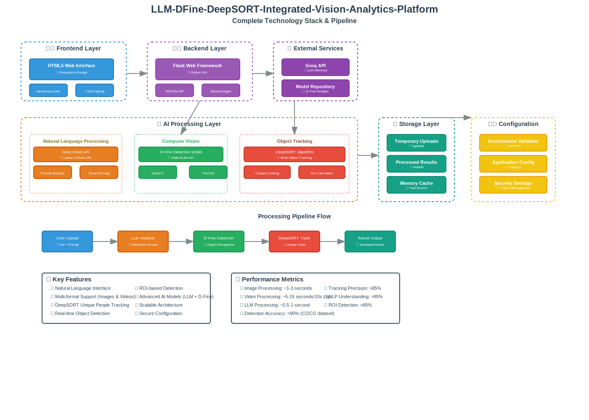

# 🤖 LLM-DFine-DeepSORT-Integrated-Vision-Analytics-Platform

An intelligent object detection system that combines **D-Fine** object detection with **Groq Llama AI** for natural language processing and **DeepSORT** for unique people tracking. This framework allows users to upload images or videos and describe what they want to detect in plain English, leveraging advanced AI models for natural language understanding, computer vision, and unique object tracking.

## 🏗️ System Architecture

### High-Level Architecture Overview


The framework consists of multiple integrated layers:
- **Frontend Layer**: Responsive web interface with real-time results
- **Backend Layer**: Flask-based RESTful API with secure session management  
- **AI Processing Layer**: Groq LLM integration with D-Fine object detection
- **DeepSORT Tracking Layer**: Unique people counting and multi-object tracking
- **Storage Layer**: Efficient file management with automatic cleanup
- **Configuration Layer**: Environment-based secure configuration management

### System Overview & Technology Stack


### Processing Pipeline Flow


### Detailed Architecture Diagrams
- 📊 **[High-Level Design](Visualizations/high-level-architecture.md)**: System components and data flow
- 🔧 **[Low-Level Design](Visualizations/low-level-design.md)**: Detailed class architecture and interactions
- 🎯 **[System Overview](Visualizations/system-overview.md)**: Complete technology stack and pipeline

## 📸 Sample Results

### Detection Results
| Input Processing | Final Output |
|-----------------|--------------|
|  |  |
| *Single frame detection with bounding boxes* | *Complete video analysis with object counts* |

## 🌟 Features

### 🎯 Smart Detection Modes
- **Count-only mode**: "count people in the image"
- **Specific region counting**: "count people in specific area"
- **Video tracking**: "track people in video" (with unique counting)
- **Standard detection**: "find all people and cars"
- **Area filtering**: "detect cars in foreground/background/center"

### 🎥 Video Processing with DeepSORT
- First frame analysis (quick processing)
- Every second analysis (detailed with unique person tracking)
- Frame-by-frame display in frontend
- **🎯 DeepSORT Unique Tracking**: No duplicate counting across frames
- **Multi-object tracking**: Persistent object IDs throughout video
- **Smart people counting**: Eliminates false positives and duplicates

### 🎯 Region Types Supported
- Specific regions (foreground/background/center/left/right/top/bottom)
- Custom areas based on natural language description

### 🔧 Advanced Features
- **Natural Language Processing**: Describe what you want to detect in plain English
- **Intelligent ROI Detection**: Automatically identifies regions of interest from text descriptions
- **Object Synonym Recognition**: Understands "people" = "person", "vehicle" = "car", etc.
- **Confidence Optimization**: Automatically adjusts detection confidence based on object type
- **Multi-format Support**: Images (PNG, JPG, JPEG, GIF) and Videos (MP4, AVI, MOV)
- **🎯 DeepSORT Integration**: Advanced multi-object tracking for unique people counting

## 🚀 Quick Start

### Prerequisites
- Python 3.8+
- A Groq API key (get one from [Groq Console](https://console.groq.com/keys))

### Installation

1. **Clone the repository**
   ```bash
   git clone <your-repo-url>
   cd LLM-DFine-DeepSORT-Integrated-Vision-Analytics-Platform
   ```

2. **Install dependencies**
   ```bash
   pip install -r requirements.txt
   ```

3. **Set up environment variables**
   ```bash
   # Copy the example environment file
   cp .env.example .env
   
   # Edit .env with your actual values
   nano .env
   ```

4. **Configure your environment**
   
   Edit the `.env` file with your settings:
   ```env
   GROQ_API_KEY=your_actual_groq_api_key_here
   FLASK_SECRET_KEY=your-very-secure-secret-key-here
   ```

5. **Run the application**
   ```bash
   python app.py
   ```

6. **Open your browser**
   
   Navigate to `http://localhost:5000`

## 🔧 Configuration

### Environment Variables

| Variable | Description | Default |
|----------|-------------|---------|
| `GROQ_API_KEY` | Your Groq API key (required) | - |
| `GROQ_MODEL` | Groq model to use | `meta-llama/llama-4-scout-17b-16e-instruct` |
| `FLASK_SECRET_KEY` | Flask secret key for sessions | `fallback-secret-key-change-me` |
| `FLASK_DEBUG` | Enable debug mode | `True` |
| `HOST` | Server host | `0.0.0.0` |
| `PORT` | Server port | `5000` |
| `MAX_CONTENT_LENGTH` | Max upload size in bytes | `16777216` (16MB) |
| `UPLOAD_FOLDER` | Upload directory | `uploads` |
| `OUTPUT_FOLDER` | Output directory | `outputs` |
| `YOLO_MODEL` | YOLO model file | `yolov8n.pt` |

## 🎮 Usage

### Web Interface

1. **Upload a file**: Choose an image or video file
2. **Describe your request**: Use natural language to describe what you want to detect

#### Example Prompts:
- "Count all people in the image"
- "Find cars in the parking lot"
- "Detect dogs in the center of the image"
- "Track people walking from left to right" (DeepSORT unique tracking)
- "Count bottles on the table"
- "Find all animals in the background"
- "Count unique people in the video" (Special DeepSORT feature)

### API Endpoints

#### Upload and Process
```http
POST /upload
Content-Type: multipart/form-data

Parameters:
- file: image or video file
- prompt: natural language detection request
```

#### Test LLM Service
```http
POST /api/test-llm
Content-Type: application/json

{
  "prompt": "count people in the center"
}
```

#### Get Results
```http
GET /outputs/<filename>
```

## 🧠 How It Works

1. **Natural Language Processing**: User's text prompt is processed by Groq Llama AI
2. **Parameter Extraction**: AI extracts detection parameters (objects, regions, confidence levels)
3. **Object Detection**: D-Fine model performs detection based on extracted parameters
4. **🎯 DeepSORT Tracking**: For videos, unique object tracking prevents duplicate counting
5. **Result Processing**: Results are formatted and returned with visualizations

### Supported Object Classes

The system can detect 80+ object classes including:
- **People & Animals**: person, cat, dog, horse, bird, etc.
- **Vehicles**: car, truck, bus, motorcycle, bicycle, etc.
- **Electronics**: tv, laptop, cell phone, remote, etc.
- **Furniture**: chair, couch, bed, dining table, etc.
- **Food & Kitchen**: apple, banana, bottle, cup, knife, etc.

## 🏗️ Project Structure

```
├── app.py                          # Main Flask application
├── config.py                       # Configuration management
├── llm_service.py                  # Groq LLM integration
├── dfine_service.py                # D-Fine object detection
├── tracking_service.py             # DeepSORT tracking logic
├── test_system.py                  # System testing utilities
├── templates/
│   └── index.html                  # Web interface
├── uploads/                        # Temporary upload storage
├── outputs/                        # Processed results
├── Visualizations/                 # Architecture diagrams & samples
│   ├── high-level-architecture.svg # High-level system design (SVG)
│   ├── system-overview.svg         # Complete technology stack (SVG)
│   ├── processing-pipeline.svg     # Processing pipeline flow (SVG)
│   ├── high-level-architecture.md  # High-level system design (Mermaid)
│   ├── low-level-design.md         # Detailed component design (Mermaid)
│   ├── system-overview.md          # Complete technology stack (Mermaid)
│   ├── frame_0029_110542.jpg      # Sample frame processing
│   └── dfine_video_summary_20250604_110623.jpg  # Sample final output
├── requirements.txt                # Python dependencies
├── .env.example                    # Environment variables template
├── .gitignore                      # Git ignore rules
└── README.md                       # This file
```

## 🔍 Testing

Run the test system to verify functionality:

```bash
python test_system.py
```

This will test:
- LLM service integration
- Object detection pipeline
- DeepSORT tracking functionality
- File processing workflows

## 🚀 Deployment

### Production Setup

1. **Set production environment variables**:
   ```env
   FLASK_ENV=production
   FLASK_DEBUG=False
   FLASK_SECRET_KEY=very-secure-production-key
   ```

2. **Use a production WSGI server**:
   ```bash
   pip install gunicorn
   gunicorn -w 4 -b 0.0.0.0:5000 app:app
   ```

### Docker Deployment

Create a `Dockerfile`:
```dockerfile
FROM python:3.9-slim

WORKDIR /app
COPY requirements.txt .
RUN pip install -r requirements.txt

COPY . .
EXPOSE 5000

CMD ["gunicorn", "-w", "4", "-b", "0.0.0.0:5000", "app:app"]
```

## 🤝 Contributing

1. Fork the repository
2. Create a feature branch: `git checkout -b feature-name`
3. Make your changes
4. Add tests if applicable
5. Commit your changes: `git commit -am 'Add feature'`
6. Push to the branch: `git push origin feature-name`
7. Create a Pull Request

## 📝 License

This project is licensed under the MIT License - see the [LICENSE](LICENSE) file for details.

## 🙏 Acknowledgments

- **D-Fine**: Advanced object detection model
- **Groq**: High-performance LLM inference
- **DeepSORT**: Multi-object tracking algorithm for unique counting
- **YOLOv8**: Real-time object detection
- **Flask**: Web framework
- **OpenCV**: Computer vision library

## 🐛 Troubleshooting

### Common Issues

1. **"No Groq API key found"**
   - Ensure `GROQ_API_KEY` is set in your `.env` file
   - Verify the API key is valid at [Groq Console](https://console.groq.com/keys)

2. **File upload fails**
   - Check file size is under 16MB
   - Ensure file format is supported (PNG, JPG, JPEG, GIF, MP4, AVI, MOV)

3. **Detection not working**
   - Verify the object you're looking for is in the supported classes list
   - Try using synonyms (e.g., "people" instead of "humans")

4. **Performance issues**
   - For large videos, try processing shorter clips
   - Reduce video resolution for faster processing

5. **DeepSORT tracking issues**
   - Ensure video has sufficient frame rate for tracking
   - Try simpler prompts like "count people" for better tracking results

## 📞 Support

For support, please:
1. Check the troubleshooting section above
2. Search existing issues in the repository
3. Create a new issue with detailed description

---

**Made with ❤️ and AI - Featuring DeepSORT Unique People Tracking**

---
