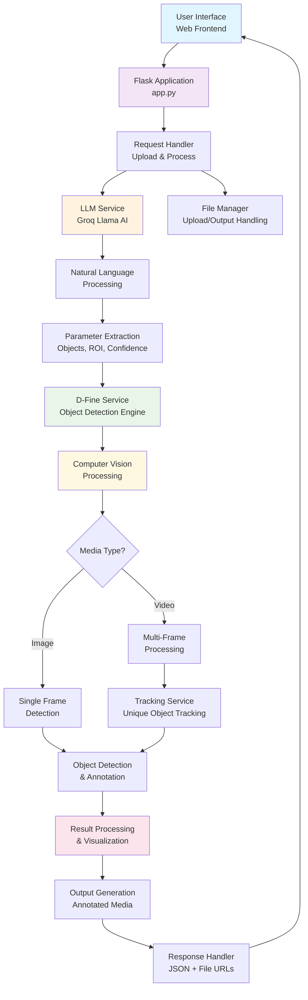

# High-Level System Architecture

## LLM-Enhanced-DFine-Object-Detection-Framework

## System Components

### 1. **Frontend Layer**
- **Web Interface**: User-friendly upload and prompt interface
- **Real-time Results**: Dynamic display of detection results

### 2. **Application Layer**
- **Flask Framework**: RESTful API and web serving
- **Request Routing**: Handle upload, processing, and result endpoints
- **Session Management**: Secure user sessions and file handling

### 3. **AI Processing Layer**
- **Groq LLM Service**: Natural language understanding
- **Parameter Extraction**: Convert text to detection parameters
- **Smart Prompt Analysis**: Object identification and ROI detection

### 4. **Computer Vision Layer**
- **D-Fine Detection**: Advanced object detection model
- **Multi-format Support**: Images and video processing
- **Tracking Integration**: Unique object tracking across frames

### 5. **Data Management Layer**
- **File Handling**: Secure upload and output management
- **Result Storage**: Temporary storage of processed media
- **Cleanup Services**: Automatic file cleanup after processing

## Key Features

- **Natural Language Interface**: Plain English detection requests
- **Multi-Modal Processing**: Images and videos
- **Real-time Processing**: Fast detection and response
- **Scalable Architecture**: Modular component design
- **Security**: Environment-based configuration 