# Low-Level System Design

## LLM-Enhanced-DFine-Object-Detection-Framework

### Detailed Component Interaction Flow


### Class Architecture


### Data Flow Architecture

```mermaid
flowchart LR
    subgraph Input["📥 Input Layer"]
        UI[Web Interface]
        API[REST API]
        Files[File Upload]
    end
    
    subgraph Processing["🧠 Processing Layer"]
        subgraph NLP["Natural Language Processing"]
            LLM[Groq LLM]
            Parser[Parameter Parser]
            Validator[Parameter Validator]
        end
        
        subgraph Vision["Computer Vision"]
            Loader[Media Loader]
            DFine[D-Fine Detection]
            ROI[ROI Processor]
            Tracker[Object Tracker]
        end
        
        subgraph Output["Output Generation"]
            Annotator[Result Annotator]
            Formatter[Response Formatter]
        end
    end
    
    subgraph Storage["💾 Storage Layer"]
        Uploads[Uploads Directory]
        Outputs[Outputs Directory]
        Cache[Temporary Cache]
    end
    
    UI --> API
    API --> Files
    Files --> Uploads
    
    API --> LLM
    LLM --> Parser
    Parser --> Validator
    Validator --> Loader
    
    Uploads --> Loader
    Loader --> DFine
    DFine --> ROI
    ROI --> Tracker
    Tracker --> Annotator
    
    Annotator --> Outputs
    Annotator --> Formatter
    Formatter --> API
    API --> UI
    
    Cache -.-> Vision
    Storage --> Cache
```



## Module Details

### 1. **LLM Service Module** (`llm_service.py`)
```python
# Key Methods:
- parse_user_prompt(prompt: str) -> dict
- _validate_and_enhance_parameters(params: dict) -> dict
- _extract_objects_from_prompt(prompt: str) -> list
- _detect_roi_from_prompt(prompt: str) -> dict
- _optimize_confidence_for_objects(objects: list) -> float

# Responsibilities:
- Natural language understanding
- Parameter extraction and validation
- Object class mapping
- ROI detection from text
- Confidence optimization
```

### 2. **D-Fine Service Module** (`dfine_service.py`)
```python
# Key Methods:
- process_media(file_path: str, parameters: dict) -> dict
- _process_image(image_path: str, params: dict) -> dict
- _process_video(video_path: str, params: dict) -> dict
- _apply_detection(frame: np.array, params: dict) -> list
- _filter_by_roi(detections: list, roi_info: dict) -> list

# Responsibilities:
- D-Fine model inference
- Image/video processing
- ROI filtering
- Result annotation
- Output file generation
```

### 3. **Tracking Service Module** (`tracking_service.py`)
```python
# Key Methods:
- update_tracking(detections: list, frame: np.array) -> list
- get_unique_count() -> int
- _calculate_iou(box1: list, box2: list) -> float
- _is_duplicate(detection: dict) -> bool
- reset_tracking() -> void

# Responsibilities:
- Multi-object tracking
- Unique object counting
- Duplicate detection prevention
- Track lifecycle management
```

### 4. **Configuration Module** (`config.py`)
```python
# Environment Variables:
- GROQ_API_KEY: Groq service authentication
- GROQ_MODEL: LLM model specification
- YOLO_MODEL: Detection model path
- File upload configurations
- Server settings

# Responsibilities:
- Environment variable management
- Default value provision
- Configuration validation
```

## Performance Considerations

### **Optimization Strategies**
- **Model Caching**: D-Fine model loaded once at startup
- **Frame Sampling**: Video processing every N frames for performance
- **Memory Management**: Automatic cleanup of temporary files
- **Batch Processing**: Multiple detections processed together
- **ROI Filtering**: Reduce processing area when specified

### **Scalability Features**
- **Stateless Design**: No session dependencies
- **Configurable Limits**: File size and processing limits
- **Error Handling**: Graceful degradation on failures
- **Resource Monitoring**: Memory and processing time tracking 